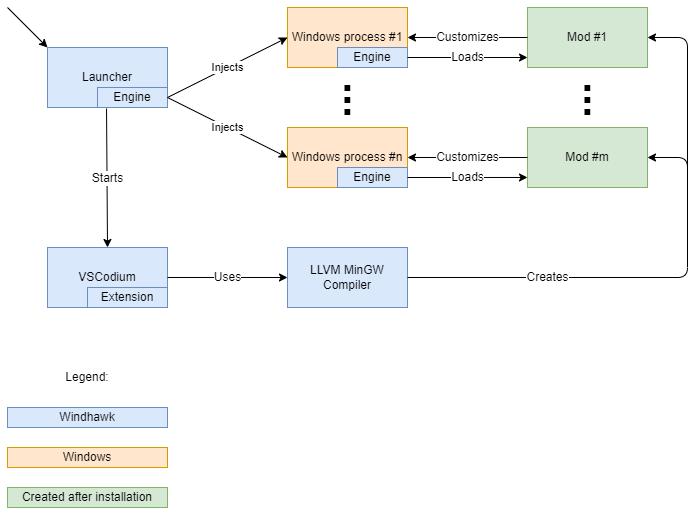

# Windhawk

Windhawk aims to make it easier to customize Windows programs. For more details, see [the official website](https://windhawk.net/) and [the announcement](https://ramensoftware.com/windhawk).

This repository is used to [report issues](https://github.com/ramensoftware/windhawk/issues) and to [discuss Windhawk](https://github.com/ramensoftware/windhawk/discussions). For discussing Windhawk mods, refer to [the windhawk-mods repository](https://github.com/ramensoftware/windhawk-mods).

You're also welcome to join [the Windhawk Discord channel](https://discord.com/servers/windhawk-923944342991818753) for a live discussion.

## Technical details

High level architecture:

For technical details about the global injection and hooking method that is used, refer to the following blog post: [Implementing Global Injection and Hooking in Windows](https://m417z.com/Implementing-Global-Injection-and-Hooking-in-Windows/).

## Source code

The Windhawk source code can be found in the `src` folder, which contains the following subfolders:

* `windhawk`: The code of the main `windhawk.exe` executable and the 32-bit and 64-bit `windhawk.dll` engine libraries.

* `vscode-windhawk`: The code of the VSCode extension that is responsible for UI operations such as installing mods and listing installed mods.

* `vscode-windhawk-ui`: The UI part of the VSCode extension.

A simple way to get started is by extracting the portable version of Windhawk with the official installer, building the part of Windhawk that you want to modify, and then replacing the corresponding files in the portable version with the newly built files.

## Additional resources

Code which demonstrates the global injection and hooking method that is used can be found in this repository: [global-inject-demo](https://github.com/m417z/global-inject-demo).
